<!--
 * @Author: Yaaprogrammer
 * @Date: 2022-05-25 08:07:39
 * @LastEditors: Yaaprogrammer
 * @LastEditTime: 2022-05-25 18:52:06
 * 
 * Copyright (c) 2022 by Yaaprogrammer, All Rights Reserved.
-->

```mermaid
graph LR;
    M1([证人心理与证人证言]);
        M1---TA & TB & TC & TD & TE & TF;

    TA([概念]);
        TAA([证人心理]);
        TAB([证人证言]);
        TA---TAA & TAB;

    TB([证人证言形成过程]);
        TBA([感知阶段]) --> TBB([记忆阶段]) --> TBC([陈述阶段]);
        TB---TBA;

    TC([影响证人证言可信性的因素]);
        TCA([证人自身的特点影响证人证言的可信性]);
        TCAA([证人的年龄]);
        TCAB([证人的性别]);
        TCAC([证人的自信心]);
        TCAD([证人的情绪]);
        TCAE([证人的期望心理]);
        TCAF([感知的持续时间]);
        TCAG([回忆的时间间隔]);
        TCAH([刻板效应和偏见]);
        TCAI([知识经验]);

        TCB([事件特点影响证人证言的可信性]);
        TCBA([事件暴力程度]);
        TCBB([事件中对象的区别性和吸引力]);

        TCC([询问者因素影响证人证言的可信性]);
        TCCA([询问的问题类型和方式]);
        TCCB([询问者的权威和态度]);
        TCCC([辨认方式]);

        TCA---TCAA & TCAB & TCAC & TCAD & TCAE & TCAF & TCAG & TCAH & TCAI;
        TCB---TCBA & TCBB;
        TCC---TCCA & TCCB & TCCC;
        
        TC---TCA & TCB & TCC;

    TD([伪证行为]);
        TDA([概念]);
        TDB([表现]);
            TDBA([虚假陈述]);
            TDBB([虚假辨认]);
            TDBC([提供虚假证据]);
            TDB---TDBA & TDBB & TDBC;
        TDC([类型]);
            TDCA([防卫型伪证动机]);
            TDCB([情感型伪证动机]);
            TDCC([利益型伪证动机]);
            TDCD([自我满足型伪证动机]);
            TDC---TDCA & TDCB & TDCC & TDCD;
        TD---TDA & TDB & TDC;

    TE([错误证言]);
        TEA([概念]);
        TEB([导致虚假记忆的原因]);
            TEBA([关联效应]);
            TEBB([误导效应]);
            TEBC([词语遮蔽效应]);
            TEBD([错觉结合]);
            TEBE([记忆植入]);
            TEB---TEBA & TEBB & TEBC & TEBD & TEBE;
        TE---TEA & TEB;

    TF([有效收集证人证言]);
        TFA([一般规则]);
            TFAA([放慢提问速度]);
            TFAB([开放式问题和封闭式问题结合]);
            TFAC([尽量不要打断证人的陈述]);
            TFAD([尽量不要重复提问]);
            TFAE([询问以证人为中心]);
            TFA---TFAA & TFAB & TFAC & TFAD & TFAD & TFAE;
        TFB([方法]);
            TFBA([建构有效收集证人证言的物理环境]);
            TFBB([营造有效收集证人证言的心理氛围]);
            TFBC([对询问者的一般要求]);
            TFB---TFBA & TFBB & TFBC;
        TF---TFA & TFB;

    M2([被害人心理]);
        M2---TG & TH & TI & TJ & TK;

    TG([含义]);
    TH([被害人在被害不同阶段的心理特点]);
        THA([被害前]);
        THB([被害过程中]);
        THC([被害后]);
        TH---THA & THB & THC;
    TI([研究被害人心理的意义]);
    TJ([被害人常见心理和行为特征]);
        TJA([不同年龄被害人常见的心理特点]);
            TJAA([未成年]);
            TJAB([中青年]);
            TJAC([老年]);
            TJAD([女性]);
            TJA---TJAA & TJAB & TJAC & TJAD;
        TJB([不同案件被害人的心理特点]);
            TJBA([侵财类案件被害人的心理特点]);
            TJBB([性侵犯被害人心理特点]);
            TJBC([伤害案件被害人心理特点]);
            TJB---TJBA & TJBB & TJBC;
        TJ---TJA & TJB;
    TK([被害人陈述过程中的心理]);
        TKA([对被害人陈述内容的审查判断]);
            TKAA([审查被害人陈述内容应遵循的基本原则]);
            TKAB([对被害人陈述审查判断的方法]);
            TKA---TKAA & TKAB;
        TKB([被害人陈述的一般心理及疏导]);
            TKBA([紧张和恐惧]);
            TKBB([容易夸大被害结果]);
            TKBC([心存顾虑]);
            TKB---TKBA & TKBB & TKBC;
        TKC([被害人陈述中的心理障碍及矫正]);
            TKCA([被害人陈述中常见的心理障碍]);
                TKCAA([被害人陈述中常见的心理障碍]);
                    TKCAAA([被害人的认知障碍]);
                        TKCAAAA([感知障碍]);
                        TKCAAAB([记忆障碍]);
                        TKCAAAC([思维障碍]);
                        TKCAAA---TKCAAAA & TKCAAAB & TKCAAAC;
                    TKCAAB([情感障碍]);
                    TKCAAC([动机障碍]);
                    TKCAAD([意志行为障碍]);
                    TKCAA---TKCAAA & TKCAAB & TKCAAC & TKCAAD;
                TKCAB([被害人心理障碍的疏导]);
                    TKCABA([心理接触]);
                    TKCABB([唤起记忆]);
                    TKCABC([帮助思考]);
                    TKCABD([抓紧时机]);
                    TKCAB---TKCABA & TKCABB & TKCABC & TKCABD;
                TKCA---TKCAA & TKCAB;
            TKCB([被害人心理障碍的疏导]);
            TKC---TKCA & TKCB;
        TKD([被害人心理损伤的恢复]);
            TKDA([要创造有利于被害人心理恢复的环境]);
            TKDB([要构建社会援助机制,促进被害人心理恢复]);
            TKD---TKDA & TKDB;
        TK---TKA & TKB & TKC & TKD;

        
```

